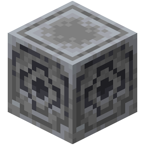

# Lodestone

<p align="center">
  
</p>

<p align="center">
  <strong>A community-driven Minecraft mod classification tool</strong>
</p>

## Overview

Lodestone is a GUI-based application that helps identify and manage client-side and server-side Minecraft mods through community-driven classification modules. Whether you're a server administrator cleaning up a modpack or a player organizing your mod collection, Lodestone streamlines the process of categorizing and managing your mods.

## Features

### 🏷️ Module-Based Classification
- Load community-curated modules that identify client-side, server-side, and universal mods
- Support for custom modules to handle specific modpacks, dependencies, or incompatibilities
- Extensible tagging system beyond just client/server classification

### 🔧 Powerful Management Tools
- **Remove** all mods matching a specific tag
- **Move** mods to different directories based on their tags
- **ZIP** collections of mods by category
- **Export** mod lists to text files for documentation

### 👥 Community Collaboration
- Tag unrecognized mods directly in the application
- Submit new mod classifications to module authors
- Contribute to growing the community knowledge base

### 📦 Flexible Module System
Modules are simple JSON files containing:
- Module metadata (name, version, author)
- Mod classifications with IDs and tags
- Easy to create, share, and maintain

## How It Works

1. **Load a module** - Start with the default client/server classification module or load custom ones
2. **Select your mods directory** - Point Lodestone to your Minecraft mods folder
3. **View classifications** - See all your mods automatically tagged based on the loaded modules
4. **Perform operations** - Remove, move, archive, or export mods based on their classifications
5. **Tag unknown mods** - Manually classify any mods not in your modules and optionally submit them back to the community

## Module Format

Modules use a simple JSON structure:

```json
{
  "header": {
    "moduleName": "Default",
    "moduleVersion": 1,
    "moduleAuthor": "mars_phobos"
  },
  "mods": [
    {
      "modID": "create",
      "modVersion": "*",
      "modType": "Both"
    },
    {
      "modID": "mousetweaks",
      "modVersion": "*",
      "modType": "Client"
    }
  ]
}
```

## Project Status

🚧 **Currently in active development** 🚧

Lodestone is being built with Rust for performance and reliability. The core architecture and data structures are complete, with GUI implementation in progress.

## Use Cases

- **Server Administrators**: Quickly strip client-only mods from server installations
- **Modpack Creators**: Organize and document mod classifications for your pack
- **Players**: Clean up mod folders and understand which mods are needed where
- **Mod Developers**: Create dependency modules for your mod ecosystem

## Why "Lodestone"?

Like the Minecraft block that points you in the right direction, Lodestone helps you navigate and organize your mod collection with precision.

## Contributing

Contributions are welcome! Whether it's:
- Adding mods to the default classification module
- Creating specialized modules for popular modpacks
- Improving the codebase
- Reporting issues or suggesting features

## Author

@mars_phobos

---

<p align="center">
  Made with ❤️ for the Minecraft modding community
</p>
